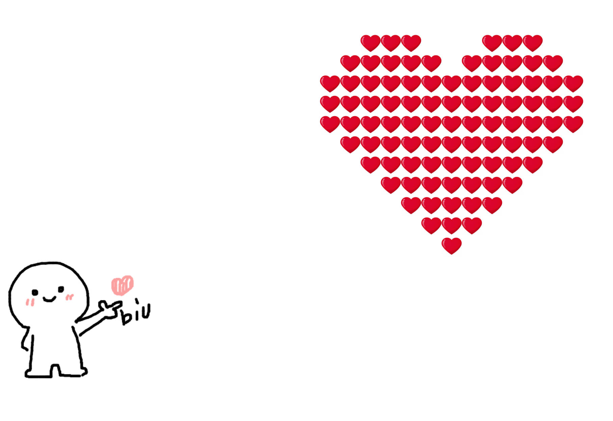

# 一些有趣的小代码

## 一、静态页面（github上面可以挂载一些静态页面，自然可以用这个来展示一些简单的小玩意）

   1. confession-fireworks 文件夹里面是一个问答小页面
      

      <!--  -->

   2. happy-new-year-fireworks 文件夹里面是一个新年祝福烟花页面
      

      <!--  -->

   3. love-heart-simple 文件夹里面是一个动态爱心页面
      

      <!--  -->

   4. love-heart-fall 文件夹是一个爱心上面会掉落文字页面
      

      <!--  -->

   5. love-heart-diamonds 文件夹是一个红色爱心变换钻石页面
      

      <!--  -->

   6. love-heart-biu 文件夹是一个小人发送爱心页面
      

      <!--  -->

   7. love-heart-boom 文件夹是爱心跳动页面
      

      <!--  -->

   8. 3d-photos 文件夹是一个3d相册页面
      

      <!--  -->

   9. love-heart-vindicate 文件夹是一个爱心表白页面
      

      <!--  -->

   10. code-vindicate 文件夹是一个代码表白页面
      

      <!--  -->

   11. love-heart-meteor 文件夹是一个背景有流星的爱心页面
      

      <!--  -->

   12. love-heart-shining 文件夹是一个闪闪的爱心页面
      

      <!--  -->

## 二、exe程序

   1. love.exe是一个以python代码生成的可以在windows上面运行的爱心程序
   2.  love.py是上面exe的源码

## 三、bat文件

   1.  shutdown 是windows的关机代码
